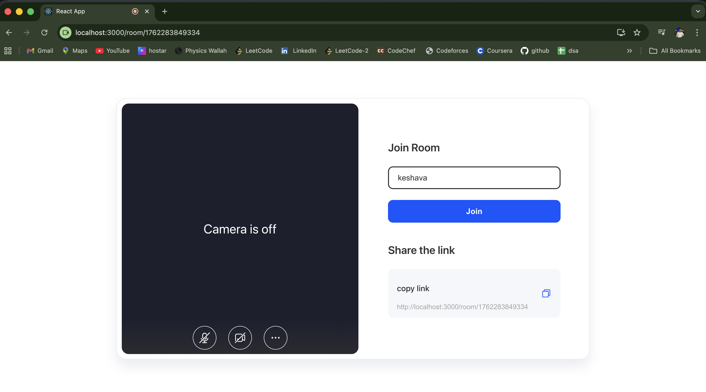
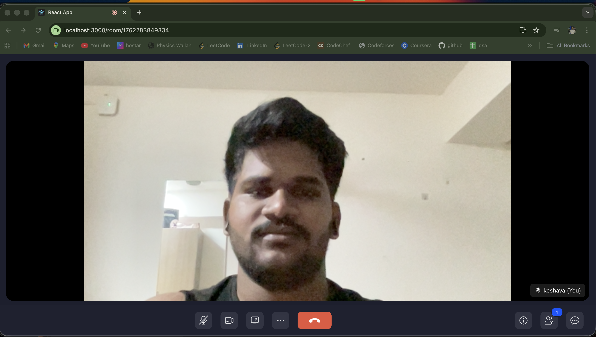
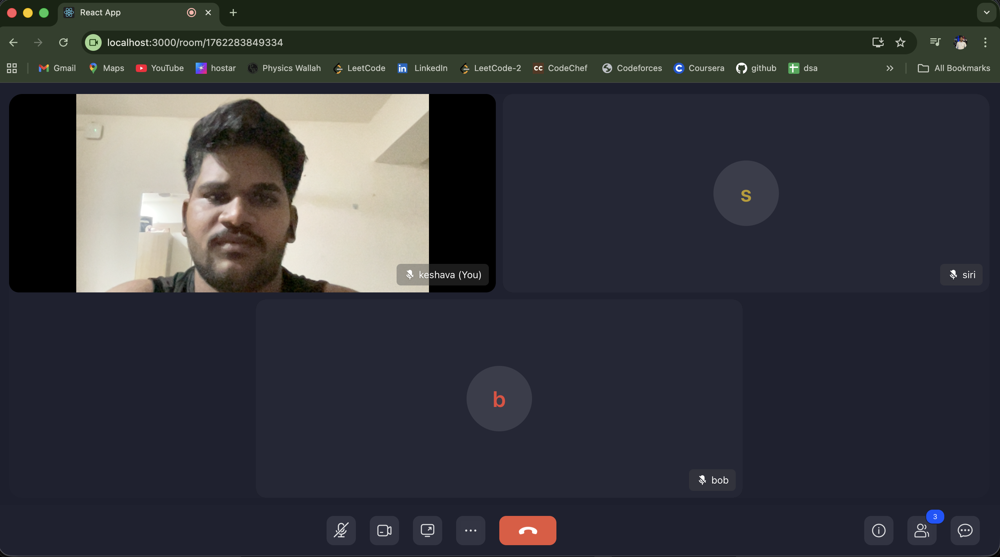
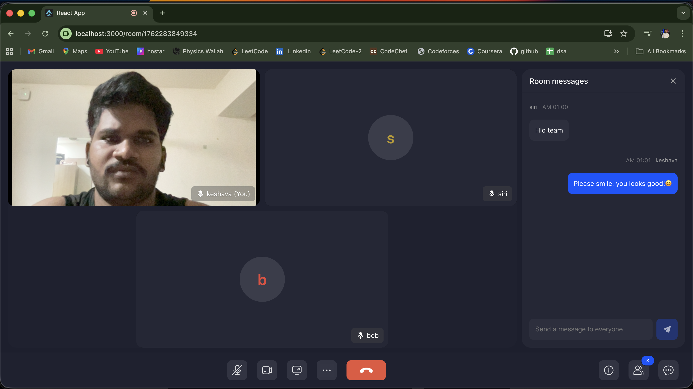
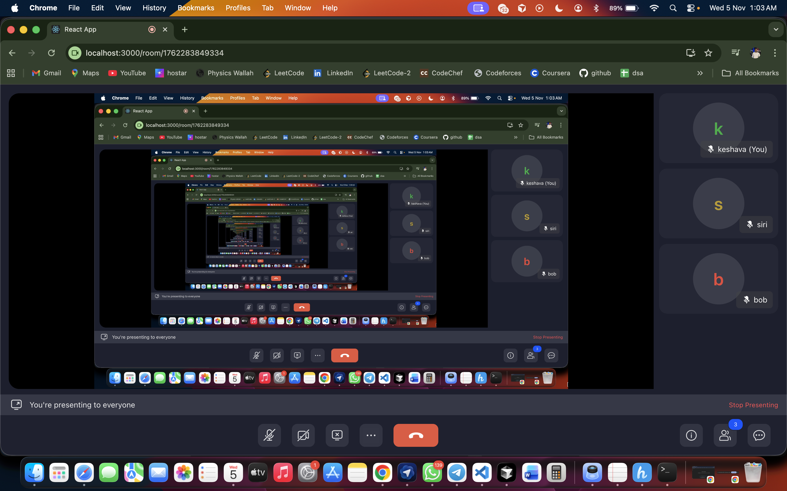

# ZegoCloud – One-to-One Video Call App (UIKits)

**ZEGOCLOUD UIKits Video Call App** is a simple one-to-one video calling application built using **React JS** and **ZegoCloud Prebuilt UIKits**.  
This allows users to join a room and communicate using camera, mic, screen share and chat — without manually writing WebRTC code.

---

## Features
- Join room using display name
- Real-time video calling
- Mute / Unmute microphone
- Turn camera ON / OFF
- Screen sharing supported
- Room chat messaging panel
- Multiple participants can also join

---

## Tech Stack
- **React JS** – Frontend UI
- **ZEGOCLOUD UIKits** – Call UI and RTC logic (pre-built)

---

## Setup Instructions (Local)
```bash
npm install
npm start

```
## Important:

Add your ZEGOCLOUD AppID + ServerSecret in:
```bash
src/config.js
```

## Screenshots







r


### 🧑‍💻 Developer

Keshava K.
💻 Software Engineer | 💼 Full Stack Web Developer
📍 Andhra Pradesh, India
🌐 GitHub

📧 kesava9347@gmail.com
